# Assignment 3

Kovalyshyn Oleh & Yevhenii Zasko

## Exploratory Data Analysis

### Toronto Dataset

Toronto Dataset is a collection of clips from the Ukrainian YouTube program "Телебачення Торонто". It contains 18 198 samples of speech with transcriptions grouped by speaker.
There are 93 labels with empty transcriptions, that, from the quick look, contain no speech. Test split is defined by hard-set speaker ids in the assignment description.

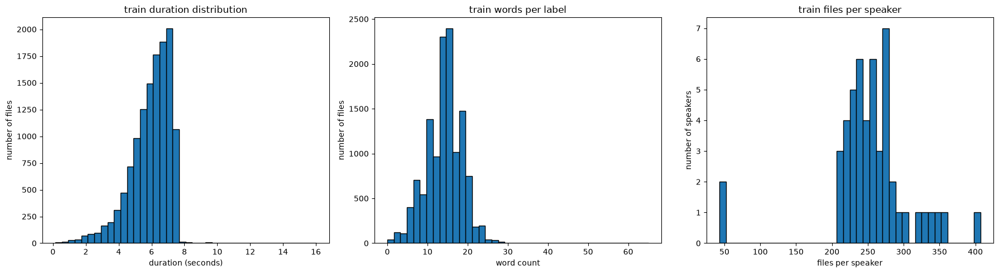
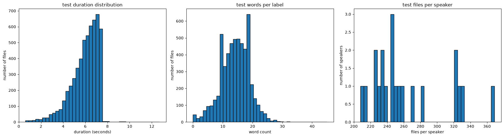

One observation is that some samples contain not only Ukrainian characters, but also numbers, russian lettern, hierohlyphs and special characters.

### TIMIT Dataset

TIMIT is a classical speech/phoneme recognition dataset containing 630 speakers (438 male, 192 female) from 8 US dialect regions totalling 6300 samples (10 per speaker). The samples are studio recorded, prepared beforehand sentences, read by the speakers. There are 3 types of sequences (Dialect, Compact, Diverse) that are meant to expose different styles of pronunciation. There is a pre-defined test/train split.

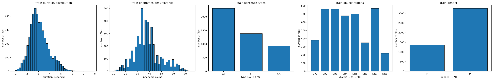
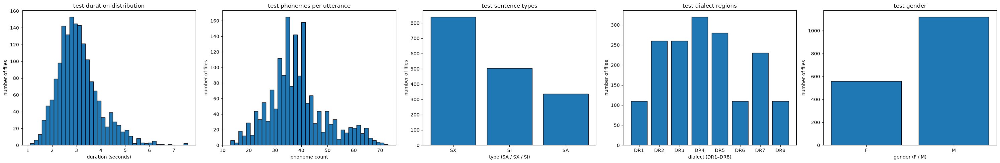

### Target Metrics

Character Error Rate (CER) and Word Error Rate (WER) are the most commonly used target metrics for speech recognition. For phoneme recognition, Phoneme Error Rate (PER) is a more suitable metric. All of them share basically the same formula, which we generalize as Error Rate (ER):

$$\text{ER}=\frac{S+D+I}{N}$$

where S, D, I is the number of substitutions/insertions/deletions and N is the total number of characters/words/phonemes.

One of the weakness of these metrics in our context, especially in the Toronto dataset is that speakers often use jargon or syrzhyk words which has no clear academic transcription. The model can than predict different characters that suit more "official" Ukrainian language, while most native speakers would've recognized the word anyway and maybe even spelled it in the same way the model did. The absence of official transcriptions for such words asks for a metric oriented for information loss, such as Word Information Lost (WIL) metric:

$$\text{WIL}=1-\bigg(\frac{C}{N}+\frac{C}{P}\bigg)$$

Where C is the number of correctly transcribed words, N is the total number of words in the ground truth transcript, P is the number of words in the predicted transcript.

WIL metric was not used in this work.

## Validation

We designed a separate validation split for both TIMIT and Toronto datasets. This split was used for Whisper and for data validation after each training epoch in SSR approach.

* For Toronto dataset, group k-fold split was used on the column `"speaker_id"` to generate the validation split from the train corpus.
* For TIMIT dataset, stratified group k-fold split was used on the columns `"dialect_region"` and `"gender"` to generate the validation split from the train corpus.

Validation split consisted of 1/5th of the training corpus data.

  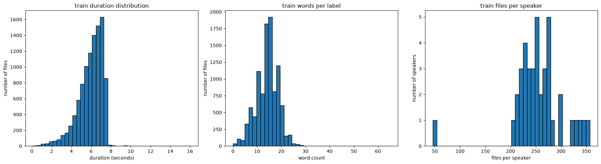
  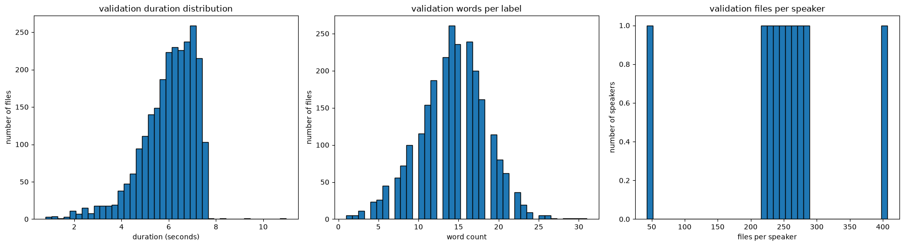
   
  <em>Resulting Toronto train & validation splits</em>

  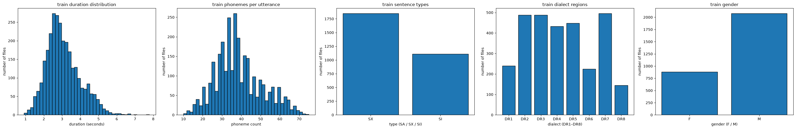
  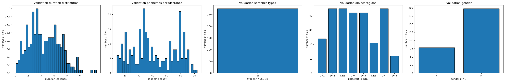
   
  <em>Resulting TIMIT train & validation splits</em>

## Whisper Approach

We trained Whisper model from the multilingual checkpoint `"openai/whisper-small"`.

  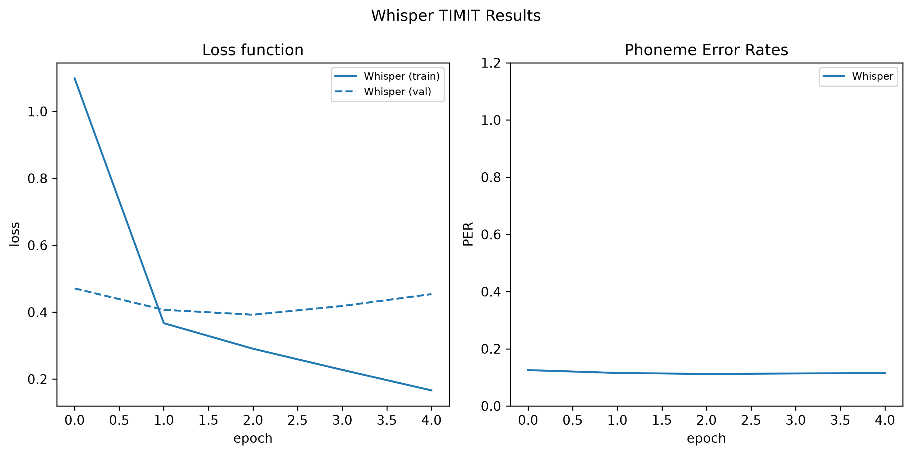
  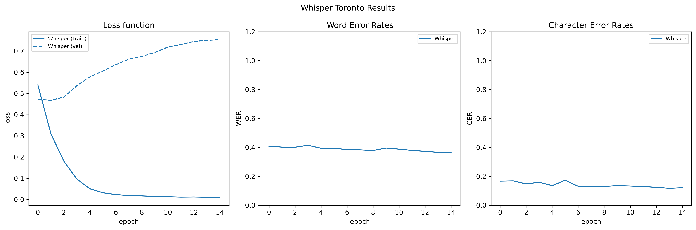

## Self-Supervised Approach

### Toronto Dataset

We trained a data2vec model based on checkpoint `"Respeecher/ukrainian-data2vec"`. As a baseline comparison, `"Respeecher/ukrainian-data2vec-asr"` model was used. Samples that contained non-Ukrainian characters were discarding, brinding down the total number of samples used to 12722 out of 18198. Character vocabulary was built based on these samples.

We trained 4 variants of the model featuring different unfreeze levels: head only, head + 4 tranformer layers, head + 12 layers, head + 24 layers. For the head, learning rate was set to `1e-4`, while for transformers it was `1e-5`. We used gradient clip at 1.0.

  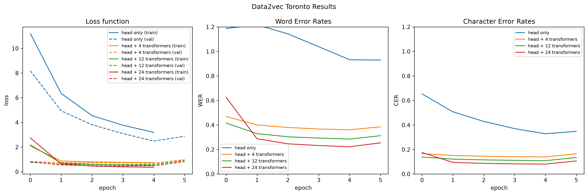

### TIMIT Dataset

We trained a data2vec model based on checkpoint `"facebook/data2vec-audio-base"`. Phoneme vocabulary was built by re-mapping the original 61 phonemes set to 39 phonemes according to Lee & Hon (1989).

We trained 4 variants of the model: head only, 4 layers, 6 layers, 12 layers.

  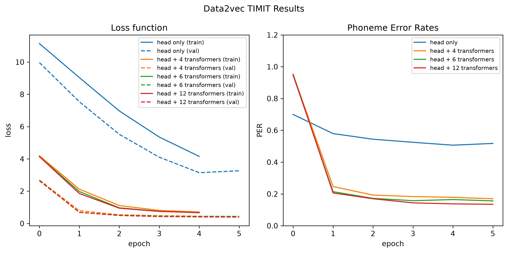

## Audio Filtering and Signal Enhancement

Given that Toronto dataset contains a lot of noise, we applied following quality improvement steps:

1. resampling to 16KHz
2. dereverberation (`npe-wer`)
3. noise reduction (`noisereduce`)
4. loudness normalization (`pyloudnorm`)

Produced clean dataset was tested against the baseline model and used for training of fine-tune models.